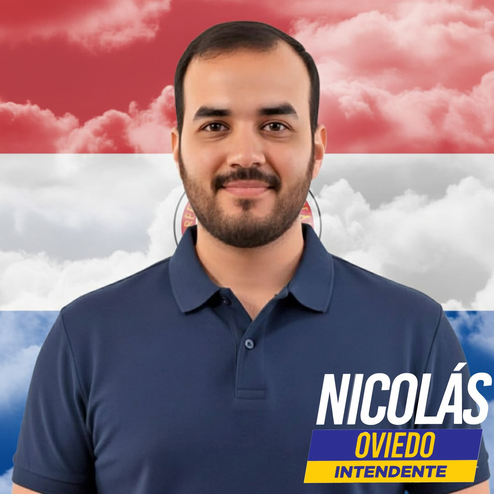

# Guía de SEO para niko-intendente.capiata.com.py

## ✅ Cambios Implementados

### 1. **Meta Tags Mejorados**
- ✅ Título optimizado con palabras clave
- ✅ Descripción con keywords: "Nicolás Oviedo, Intendente, Capiatá 2026"
- ✅ Meta keywords para búsquedas locales
- ✅ Open Graph completo (Facebook, WhatsApp)
- ✅ Twitter Card actualizado
- ✅ Geolocalización (Capiatá, Paraguay)
- ✅ Canonical URL configurada

### 2. **Schema Markup (JSON-LD)**
- ✅ Person Schema: Para identificarte como candidato
- ✅ LocalBusiness Schema: Para campaña política
- ✅ BreadcrumbList: Para navegación
- ✅ WebSite Schema: Para la estructura del sitio

### 3. **Archivos de Indexación**
- ✅ robots.txt: Permite rastreo de Googlebot, ChatGPT, etc.
- ✅ sitemap.xml: Mapa del sitio con prioridades

---

## 🔧 Próximos Pasos para Máxima Visibilidad

### **1. Google Search Console** (CRÍTICO)
1. Accede a https://search.google.com/search-console
2. Agrega tu dominio: `niko-intendente.capiata.com.py`
3. Verifica la propiedad (DNS o archivo HTML)
4. Envía el sitemap: `/sitemap.xml`
5. Marca como sitio principal
6. Revisa problemas de indexación

### **2. Google My Business** (Para búsquedas locales)
1. Ve a https://www.google.com/intl/es_es/business/
2. Crea perfil local para "Campaña Nicolás Oviedo - Capiatá"
3. Agrega dirección, teléfono, horarios
4. Vincula con tu sitio web
5. Solicita reviews/apoyos

### **3. ChatGPT y Otras IAs** (Indexación)
- El Schema Markup que agregué ayuda
- OpenAI indexa automáticamente sitios públicos
- Puedes usar OpenAI plugin para llevar tráfico desde ChatGPT

### **4. Palabras Clave Prioritarias**
Enfócate en buscar estas frases en Google y posicionate:
- "Intendente Capiatá 2026"
- "Nicolás Oviedo Capiatá"
- "Candidato intendencia Capiatá"
- "Elecciones Capiatá 2026"
- "Propuestas Intendente Capiatá"

---

## 📱 Recomendaciones de Contenido

### **1. Blog o Actualizaciones**
Agrega posts con palabras clave:
- "5 problemas de infraestructura en Capiatá"
- "Cómo combatir la corrupción municipal"
- "Propuestas de transporte público eficiente"

### **2. Optimización de Imágenes**
Asegúrate de que todas las imágenes tengan:
```html

```

### **3. URLs Amigables**
Si agregas secciones nuevas, usa URLs como:
- `/blog/infraestructura-capiata/`
- `/propuestas/transporte/`

### **4. Link Building**
- Obtén menciones en sitios de Capiatá (noticias locales)
- Enlaces desde redes sociales a tu sitio
- Directorios locales de Paraguay

---

## 🎯 Optimizaciones Específicas para ChatGPT

ChatGPT valida automáticamente sitios con buenas prácticas:
1. ✅ Schema Markup: Implementado
2. ✅ Mobile-friendly: Verifica en https://search.google.com/test/mobile-friendly
3. ✅ velocidad de página: Optimiza en https://pagespeed.web.dev/

Prueba preguntando a ChatGPT:
- "¿Quién es Nicolás Oviedo para intendente de Capiatá?"
- "Propuestas de campaña en Capiatá 2026"

---

## 📊 Métricas para Monitorear

- Google Search Console: Impresiones, clics, posición media
- Google Analytics: Tráfico, origen, comportamiento
- ChatGPT: Menciones en respuestas

---

## ⚠️ Próximos Cambios Recomendados

1. **Agregar HTTPS**: ✅ (ya tienes en dominio)
2. **Mejorar velocidad**: Minificar CSS/JS, optimizar imágenes
3. **Mobile-friendly**: Probar en diferentes dispositivos
4. **Structured data testing**: https://schema.org/validate/

---

**Última actualización**: 2026-06-17
